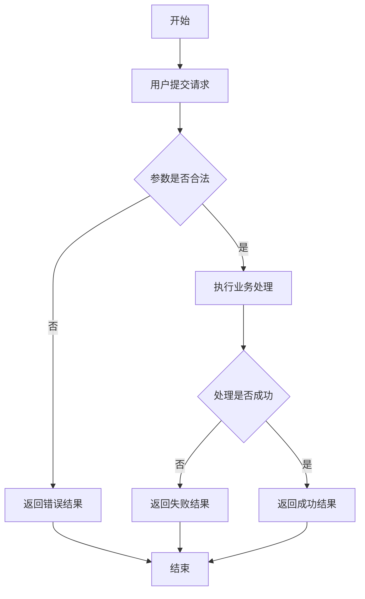
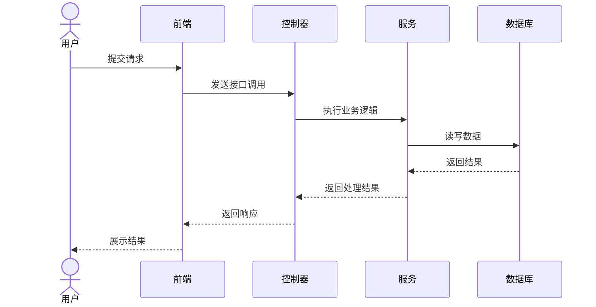
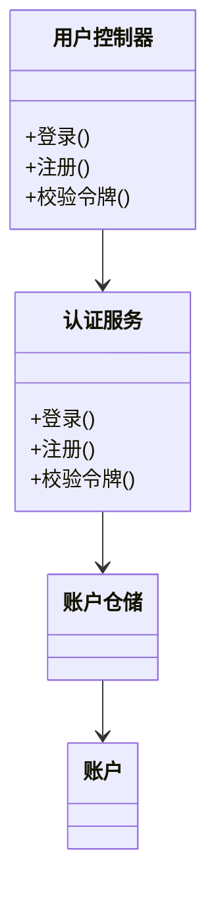

# UML 图生成技能

## 本技能做什么

本技能用于把用户提供的业务需求、接口说明、代码结构、控制器逻辑、服务调用链或模块设计信息，转化为规范、可渲染、可直接复用的 UML 图文本，并补充专业化说明文字。支持以下三类核心图形：

- 流程图：用于描述业务流转、分支判断、异常路径、用户操作与系统响应
- 时序图：用于描述参与者之间的调用顺序、同步关系、返回结果与异常处理
- 类图：用于描述实体、控制器、服务、仓储、数据传输对象之间的结构关系

## 何时必须触发

当用户出现以下任一意图时，必须使用本技能：

- 明确要求生成 UML 图
- 提到流程图、业务流程图、登录流程图、注册流程图、审核流程图
- 提到时序图、调用时序、接口调用链、前后端交互顺序
- 提到类图、模块关系图、实体关系梳理、模块设计图、类结构分析
- 提到“根据代码生成图”“根据控制器生成图”“根据接口说明画图”
- 提到“顺便补一段图示说明”“用于论文/文档/答辩的图和说明文字”

## 输出原则

生成图时必须遵循以下原则：

1. 先识别目标图类型；若用户未明确说明，则根据任务自动选择最合适的图
2. 优先依据用户提供的真实代码、真实字段、真实接口与真实调用关系绘图，不得凭空虚构核心节点
3. 图中节点命名必须与业务语义一致，必要时可对代码名进行中文业务化翻译
4. 图必须能直接复制到常见渲染器中使用，使用PlantUML语法输出
5. 图后必须补专业化叙述文字。叙述主体为图的核心信息，如参与者、动作、判断条件、结果等。禁止使用”该流程图很好的描述
6. 图中所有箭头，连线，必须为直线，可以斜直线或者直角拐弯，绝对禁止曲线出现。类图禁止直角拐弯，必须斜直线连接
7. 线条之间必须有间距，不能太近，尽量避免线条交叉
8. 描述控制器、服务等概念时，直接使用Controller、Service等英文名。数据存储方面表达直接使用mysql

## 默认图形语法

默认优先级如下：

1. `PlantUML`
2. 用户指定的其他语法

除非用户明确要求使用其他格式，否则默认输出 `PlantUML`。

## 工作流程

### 第一步：识别输入来源

先判断用户给出的依据属于哪一类：

- 业务描述：从需求句子中提取参与者、动作、判断条件、结果
- 接口描述：从请求入口、参数校验、服务调用、返回状态中提取流程
- 代码片段：从控制器、服务、仓储、实体、数据传输对象中提取结构和关系

### 第二步：识别适合的图类型

- 如果重点是“步骤如何流转”，生成流程图
- 如果重点是“谁先调用谁”，生成时序图
- 如果重点是“有哪些类以及如何关联”，生成类图
- 如果用户要求多种图，则分别输出多个图，并保持命名一致

### 第三步：抽取核心信息

必须优先抽取以下信息：

- 参与者：用户、前端页面、控制器、服务、仓储、数据库、外部系统
- 输入：表单、参数、请求头、令牌、主键、查询条件
- 处理：鉴权、校验、查重、持久化、查询、更新、删除、映射转换
- 分支：成功、失败、未授权、参数错误、资源不存在、冲突
- 输出：状态码、响应体、页面跳转、错误提示、数据回填

### 第四步：生成图文本

图文本必须满足：

- 结构完整
- 分支闭合
- 命名清晰
- 与源码含义一致
- 语法可直接渲染

### 第五步：补说明文字

当用户要求“增加说明”“用于论文”“需要专业表述”“不要分点”时，必须在图后补一段连续行文说明。说明文字应：

- 使用正式、专业、客观的描述语言
- 准确概括流程起点、关键校验、核心处理、分支控制与结果返回
- 避免口语化表达
- 避免分点，输出为一整段

## 三类图的生成规范

## 流程图规范

适用于：

- 登录
- 注册
- 令牌校验
- 数据填报
- 审批流程
- 查询与筛选流程

要求：

- 必须包含开始与结束
- 必须明确输入动作、校验节点、条件分支、成功路径、失败路径
- 如果存在令牌校验、数据库查询、冲突判断、状态码返回，必须显式画出
- 对前后端联动流程，可同时体现页面行为与后端行为
- 连线为直线，可以采用斜直线

严厉禁止：
    - 曲线拐弯、任何形式的曲线。

推荐模板：

## 时序图规范

适用于：

- 登录认证
- 前端调用后端接口
- 控制器到服务再到数据库的调用链
- 多角色协作流程

要求：

- 参与者顺序要符合真实调用方向
- 要体现请求、处理、返回三个层次
- 出现异常分支时，使用 `alt`、`else`、`opt` 等结构清晰表达
- 返回值应写明关键结果，如令牌、状态码、数据对象
- 所有线条必须为直线，禁止出现曲线拐弯，需要拐弯就采用90度直角拐弯

严厉禁止：
    - 曲线拐弯、任何形式的曲线。

推荐模板：

## 类图规范

适用于：

- 系统设计说明
- 分层架构关系梳理
- 实体与服务依赖说明
- 控制器、服务、仓储、模型之间的结构表达

要求：

- 必须区分类、接口、实体、数据传输对象
- 必须体现依赖、关联、组合、继承或实现关系
- 类成员不必机械性罗列全部内容，应优先保留关键字段与关键方法
- 若代码规模较大，应只保留与当前主题相关的类

推荐模板：

## 对代码生成图时的强制要求

如果用户给出的是代码而不是纯需求，必须做到：

- 先阅读入口方法，再向下识别服务调用与数据访问关系
- 不遗漏显式分支，例如未授权、参数异常、资源冲突、空结果
- 对响应对象、请求对象、记录类型、实体类型进行角色区分
- 不将导入语句误判为业务依赖
- 对临时测试方法、废弃方法、无映射注解的方法进行弱化处理或忽略

## 对论文和文档场景的输出要求

如果用户目标是论文、毕业设计、课程设计、系统设计说明书，则输出结构应优先采用：

1. 图标题
2. 图代码
3. 一段正式说明文字

说明文字风格要求：

- 强调时序性、控制逻辑、分支条件、数据流向和结果反馈
- 使用“系统首先……随后……在……条件下……最终……”这一类正式论述方式
- 不使用口语化表达
- 不使用列表，除非用户明确允许

## 结果自检清单

输出前必须自检：

- 图类型是否与用户目标一致
- 节点和关系是否来自真实信息
- 是否覆盖成功与失败分支
- 语法是否可渲染
- 若用户要求说明文字，是否已补充正式说明
- 若用户要求“不分点”，说明部分是否为单段连续文本

## 可直接复用的触发示例

以下用户输入均应触发本技能：

1. “根据登录接口代码生成流程图，并补一段论文风格说明。”
2. “把这个控制器整理成时序图。”
3. “根据当前模块的实体、服务和仓储关系生成类图。”
4. “帮我画一个注册与登录的 UML 图，要求能直接复制到 Mermaid。”
5. “根据前后端代码梳理调用链，输出时序图和文字说明。”

